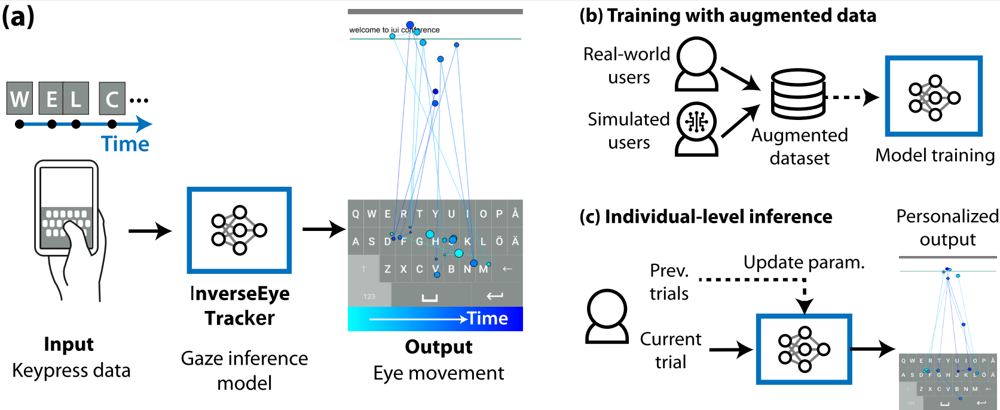

# GOOGLYEYES

[//]: # (add the teaser image here from figs/teaser.png)


We present a model for inferring where users look during interaction based on keypress data only. Given a key log, it outputs a scanpath
that tells, moment-by-moment, how the user had moved eyes while entering those keys. The model can be used as a proxy for human
data in cases where collecting real eye tracking data is expensive or impossible

## Installation

[//]: # (first create a conda env with python3.8, then pip install -r requirements.txt)
[//]: # (then install the package with pip install -e .)

We recommend using `conda` to create an environment with Python 3.8 and then install the required packages with `pip`.

```bash
conda env create --name googlyeyes python=3.8
conda activate googlyeyes
pip install -r requirements.txt
```
## Play with the model

We provide 4 trained models saved the 'src/best_outputs' directory.

#### GOOGLYEYES

```bash
python src/googlyeyes_trainer.py --test --data_use both
```

#### GOOGLYEYES w/o data augmentation

```bash
python src/googlyeyes_trainer.py --test --data_use human
```

#### GOOGLYEYES w/o user parameter inference


```bash
python src/baseline_trainer.py --test --data_use both
```

#### GOOGLYEYES w/o user parameter inference w/o data augmentation

```bash
python src/baseline_trainer.py --test --data_use human
```

for training your own model, you can change the `--test` flag to `--train`.

## Visualization

We provide visualization tools for generating images and videos of the model's output. Check the `src/visualization.py` file for details.

To select which model to visualize, you can set the `--data_use` and `--amortized-inference` flags.

#### Generating images for the GOOGLYEYES model

```bash
python src/visualization.py --data_use both --amortized-inference --method image
```

#### Generating videos for the GOOGLYEYES model

```bash
python src/visualization.py --data_use both --amortized-inference --method video
```

<table align="center">
  <tr>
    <td align="center">
      <br>
      <b>Ground Truth Gaze Movement</b>
    </td>
    <td align="center">
      <br>
      <b>Inferred Gaze Movement</b>
    </td>
  </tr>
</table>

## Analyzing the performance

We also provide code for analyzing the results of the model, check the `analysis/analysis.py` file for details.


## troubleshooting

if you get an error like this when running v:

```
libGL error: MESA-LOADER: failed to open iris: /home/User/anaconda3/envs/googlyeyes/bin/../lib/libstdc++.so.6: version GLIBCXX_3.4.30' not found (required by /lib/x86_64-linux-gnu/libLLVM-15.so.1) (search paths /usr/lib/x86_64-linux-gnu/dri:\$${ORIGIN}/dri:/usr/lib/dri, suffix _dri)
libGL error: failed to load driver: iris
```

you can try to create a symbolic link to the system's `libstdc++.so.6` via:

```bash
ln -s /usr/lib/x86_64-linux-gnu/libstdc++.so.6 /path/to/env/googlyeyes/lib/libstdc++.so.6
```
